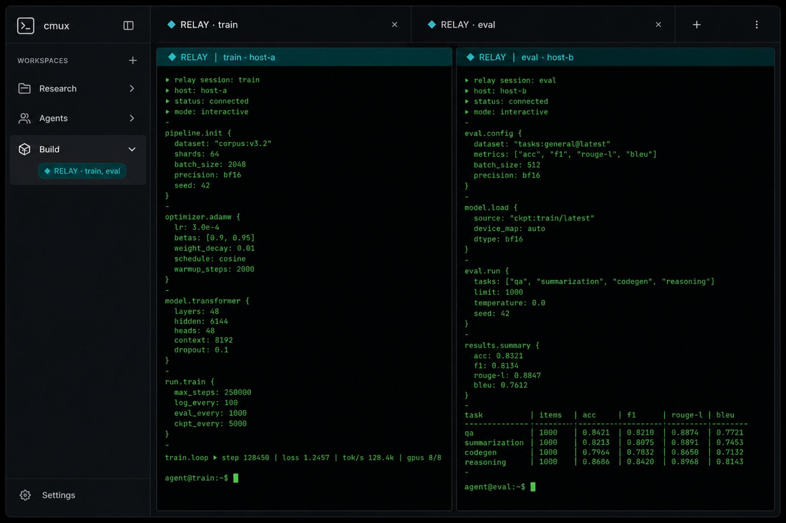

# relay

**Durable remote agent panes for [cmux](https://cmux.com)** — plus a small CLI that agents can drive without poll loops.

`relay` attaches long-lived remote work (SSH + tmux + optional `relayd`) into cmux workspaces, marks those tabs with a teal **◆ RELAY** badge, and restores them after cmux quit / Mac reboot via cmux Vault.

<p align="center">
  
</p>

<p align="center"><em>Illustrative UI (anonymized hosts). Real tabs look like <code>◆ RELAY · train</code> with a matching sidebar pill.</em></p>

<p align="center">
  
</p>

## Why

cmux is great at local workspace UX. Remote agent work still needs:

1. **Persistence** — the process must survive laptop sleep, wifi blips, and quitting cmux  
2. **Reattach** — panes should come back as the same session, not a fresh shell  
3. **Agent-friendly control** — orchestrators need `start → wait → send → done` without `tail -f` loops  
4. **Visual ownership** — you should see at a glance which tabs are relay-managed  

relay is the thin control plane for that. cmux stays the windowing surface; relay never owns lifecycle through the GUI alone.

## Use cases

### 1) Remote coding agent that survives cmux quit

Hand a goal to Claude / Codex / cursor-agent on a lab box. Close cmux. Reopen later — Vault runs `relay resume --session …` and the pane is back in the same tmux session.

```bash
relay agent start -H host-a --agent cursor-agent --goal "fix the flaky eval; keep tests green"
# → {"next":"wait","argv":["relay","agent","wait",…]}
relay agent wait --handoff ho-… [--timeout 120]
```

### 2) Project workspace with several durable remotes

One cmux workspace with a parent pane on the left and its relay children stacked
on the right (train + eval, app + benchmark). Sidebar pill:

`◆ RELAY · train, eval`

```bash
relay session adopt -H host-a --name train
relay session adopt -H host-b --name eval
relay viz present sess-… --workspace workspace:N   # split by default
relay viz brand                                    # refresh ◆ RELAY titles + pills
```

For the common interactive path, use the host/name shorthand. It creates (or
reuses) the named remote tmux session and binds it to the **current** cmux pane:

```bash
relay c3 research
```

That pane carries a persistent reverse Unix-socket bridge to the desktop. A
`relay` command run inside it is executed by the desktop control plane, so it
can open the next host in cmux without giving a remote machine direct access to
cmux:

```bash
# inside c3/research
relay c1 followup

# anywhere in the relay control plane
relay history
# c3/research (human)
# └─[relay]→ c1/followup (human)

# an agent handoff records the agent and ho-… edge as well
relay agent start -H c1 --agent codex --name analysis --goal "continue the analysis"
```

Child placement follows the recorded session binding, not whichever pane is
currently focused. The first child splits `right` from its parent; later
children of that parent split `down` from the newest live sibling. Explicit
`--workspace` / `--pane` placement overrides the default. Inspect the
session-keyed records with `relay pane list`.

### 3) Bring a new machine online

Discover SSH aliases, probe agent CLIs, propose `host.yaml`, bootstrap `relayd`:

```bash
relay targets --json
relay host discover -H host-a --json
relay host init -H host-a --apply   # installs relay + relayd on the host
```

### 4) Orchestrator / skill loop (no poll loops)

Skills live in this repo (`skills/relay-sessions`, `skills/relay-handoff`). Agents follow JSON `next` / `argv` only — never `events tail -f` in a tight loop.

## Install

```bash
git clone https://github.com/dostos/relay.git
cd relay
./install.sh          # ~/.local/bin/relay{,d} + skill symlinks
relay doctor --json
relay install-cmux-restore   # register Vault resume agent (also run by install.sh)
```

In cmux: **Settings → Terminal → Resume Commands** → approve **relay** once.

Skills are versioned under [`skills/`](skills/) and symlinked into `~/.claude/skills` (and `~/.codex/skills` when Codex is present). Edit in-repo; re-run `./install.sh`.

## Quick start with cmux

```bash
# one-time per remote
relay host init -H HOST --apply

# run work
relay HOST NAME                     # current pane → named remote tmux
relay agent start -H HOST --agent claude --goal "…"
# or attach an existing tmux session
relay session adopt -H HOST --name my-tmux
relay viz present sess-…          # opens a cmux split; ◆ RELAY tab title

# after cmux restart (or laptop sleep / wifi drop)
relay resume list                 # live | disconnected | cleaned
relay resume                      # bare: this cmux pane's history
relay resume --session NAME       # pin + waits/retries on SSH drop
relay viz restore                 # optional manual path
```

`relay resume` keeps the pane alive across sleep and “Shared connection … closed”: on drop it shows a single animated status line (spinner + countdown) and retries after a short delay (default 3s), frozen to that pane’s session. Bare `relay resume` (no `--session`) reads `~/.local/state/relay/panes/<surface>.json` (or the cmux surface resume binding). Disable reconnect with `--no-reconnect` or `RELAY_AUTO_RECONNECT=0`.


| Resume presence | Meaning | Resume? |
|-----------------|---------|---------|
| `live` | tracked locally | yes |
| `disconnected` | cmux/SSH dropped; remote may still be up | yes |
| `cleaned` | intentional destroy/finalize | **no** |
| `unknown` | never created here | no |

## How it fits cmux

| Layer | Role |
|-------|------|
| **cmux** | Workspaces, splits, tabs, Vault resume UI |
| **relay CLI** | Session/handoff IDs, `viz present`, branding, agent JSON API |
| **desktop bridge** | Local Unix-socket daemon; serializes remote requests and owns cmux operations |
| **tmux** (remote) | Durable process surface |
| **relayd** (remote) | Always-on event bus over a **Unix socket only** (no TCP listen) |

Host profiles (`~/.config/relay/host.yaml` on each remote) list agent CLIs and `path_map`. Connection coords stay in your SSH config — relay only uses Host aliases.

The desktop bridge is started on demand by `relay resume`. Its socket is
`~/.local/state/relay/desktop-bridge.sock` (0600). Each attached pane uses SSH
stream-local reverse forwarding to expose a per-session socket under `/tmp` on
the remote host. Requests carry a per-session token, and the bridge allowlist
is limited to named-session and handoff operations. There is no TCP listener or
inbound connection to the laptop; the forward lives and reconnects with the
pane's dedicated SSH connection.

Remote-to-remote commands require a session created by this bridge-aware relay
version. The shorthand can still adopt an older tmux session for attachment,
but it warns that the legacy shell has no bridge identity; choose a new `NAME`
to enable chaining.

## CLI map

```text
relay targets / host discover / host init   # new machine
relay HOST NAME                             # named tmux in current cmux pane
relay session … / session adopt             # durable tmux
relay agent start|wait|send|capture|done    # orchestrator API
relay history                               # source → destination lineage
relay pane list                             # owned surface/workspace/pane + parent + liveness
relay pane rename SESSION_ID NAME           # durable display alias; leaves tmux identity intact
relay viz present|brand|save|restore        # cmux surface
relay resume --session NAME                 # Vault target
```

Details: [`docs/2026-07-24-relay-design.md`](docs/2026-07-24-relay-design.md).

## Develop

```bash
go test ./...
go build -o bin/relay ./cmd/relay
./install.sh
```

## License

See repository for license terms.
